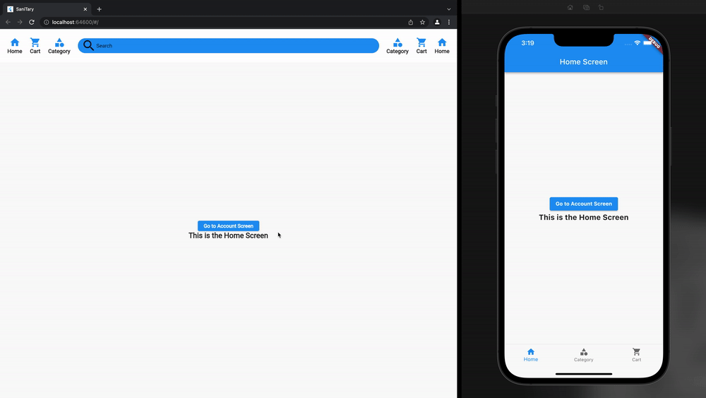
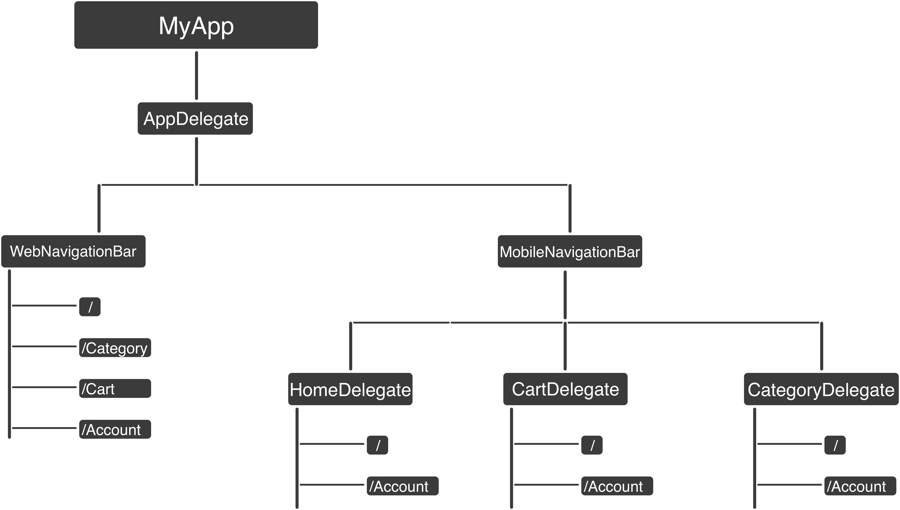

<h1 align="center">Flutter - Nested Routes With BottomNavigationBar And Deep Links For WEB</h1>

## Table Of Content.

- [Table Of Content.](#table-of-content)
- [ℹ️ About](#---about)
- [📱 App Preview](#---app-preview)
- [⁉️️ What Is Navigator 2.0](#----what-is-navigator-20)
- [📑 Stacked Routes Concept](#---stacked-routes-concept)
- [📦 Bloc Package.](#---bloc-package)
- [👨🏽‍💻 Who Am I.](#--------who-am-i)
- [References](#references)

<small><i><a href='http://ecotrust-canada.github.io/markdown-toc/'>Table of contents generated with markdown-toc</a></i></small>

## ℹ️ About

In Flutter, it's pretty easy to create a nice-looking BottomNavigationBar like LinkedIn, Facebook, Reddit, etc... but the problem appears when you try to navigate to another page. You will find your BottomNavigationBar disappeared and you no longer have access to it. with the help of Navigator 2.0, Bloc, and the Stacked route concept this repo can help solve this problem.

## 📱 App Preview

## ⁉️️ What Is Navigator 2.0
Initially, navigation between pages in Flutter was possible with Navigator 1.0 only, which could push and pop pages. Most use cases required basic navigation which was not a problem for Navigator 1.0. But with the introduction of more complex navigation use cases — especially after Flutter for Web came out — developers wanted the ability to add multiple pages in one go or remove any offscreen page(s) on the on-screen page. To cover these use cases, the Flutter team introduced Navigator 2.0.
- Note: I am assuming that you know about navigator 2, and I am not going to explain here in detail what navigator 2.0 is. If you would like to learn more about it, you can find a series of pretty good tutorials that explain flutter navigator 2 [here](https://medium.com/geekculture/a-simpler-guide-to-flutter-navigator-2-0-part-i-70623cedc93b)

## 📑 Stacked Routes Concept
The Navigator 2.0 is a list of pages created using RouterDelegate class. and in the first class (top of widget tree) instead of calling MaterialApp(home: Home()), we call MaterialApp.router(routerDelegate: instanceOfRouterDelegate). and router delegate starts stacking pages as we push and pop routes e.g ("/" or "/home"). Great, now what we need is when we create a BottomNavigationBar and use the push method actually the BottomNavigationBar is inside one of the routes that we created in MyRouterDelegate class. even if I made every route has Scaffold and the BottomNavigationBar on top of it, it wouldn't work because now every NavigatorItem will have the same page we pushed, and we lose independence. too so to solve this problem we need each item of the navigation to have its own stack of widgets. We can achieve that by creating a RouterDelegate for each item of BottomNavigationBar as you can see in the diagram below, and the main router delegate will be for deep links and the web navigation bar.

## 📦 Bloc Package.
I used the bloc package here just to inject an instance of the RouterDelegates, so I can easily call push/pop anywhere I want. You can use getIt or Provider whatever you prefer.

## 👨🏽‍💻 Who Am I.
I am Omar Khaled, I am a front-end mobile developer. I love open source projects because it saves developers time, and it's actually helped me to become what I am now.
LinkedIn: [in/omar-hanafy](https://www.linkedin.com/in/omar-hanafy)
Email: omar_hanafy@icloud.com

## References
- Navigation 2.0 definition: [Raywenderlich](https://www.raywenderlich.com/19457817-flutter-navigator-2-0-and-deep-links)
- Navigator delegate/deep links code: [Lee Phillips](https://github.com/theLee3/flutter_nav_demo)